

   

  
  <h1>Welcome to Simple Music Player!</h1>
  
  
  
  

**SimpleMP** or **Simple Music Player** is a simple and easy to use music player for free. It plays the most common music files (mp3, ogg, wma, wav) in a very simple way, just drag&drop your files or folders on the main screen and push play...

So why another music player? When I decided to make my own player back in 2005, the `Winamp 3` player was too buggy and very slow! I used my favorite programming language Delphi 5 and I learned a lot of new stuff. It was a great time and a few people in the Delphi community honored my work :-). Unfortunately, the interface of the FMOD sound library was no longer supported for Delphi, so I decided in 2007 to stop working on it.

In 2012 (after long time), I decided to make a new one!

Attention: This is a develop playground for me. It's a newer version of my old simple music player ([SimpleMP](http://jkarger.de/simple-music-player/)).

It's not perfect and many function not yet implemented.

***Use it with your own risk!***

## Simple functions

+ Plays **mp3**, **ogg**, **wma** and **wav** files (should be enough... or not?)
+ Drag&Drop your files or directories into the player (on the play list)
+ Drag&Drop files within the playlist
+ Add directories to the medialib (not yet finished)
+ Simple 10 band equalizer
+ Simple volume fade in and out (5 sec per default, can be changed in the settings file)
+ Shortcut keys if the player is on top and has the focus
	+ **[Space]** play or pause current file (if none is playing, the first selected file starts)
	+ **[Enter]** play selected files
	+ **[Del]** delete selected files from current playlist
	+ **[j]** play next file
	+ **[k]** play previuos file
	+ **[s]** shuffle mode on / off
	+ **[r]** repeat play list on / off
	+ **[m]** mute player on / off
	+ **[e]** show the equalizer
	+ **[l]** show the medialib
+ Flexible, responsive UI (different views for different window sizes)
+ You can link with the supported files (open with...)
+ Working as single instance, that means
	+ if you try start the player twice you get always the first started player
	+ if you link with supported media files, the player loads the new files and play the first file from the added files
+ Tooltip on playlist files
+ Dpi aware (per monitor)

## Releases

From time to time I'll build and publish a new pre-release which can be find here:

- [All](https://github.com/punker76/simple-music-player/releases)
- [v1.9.2](https://github.com/punker76/simple-music-player/releases/tag/v1.9.2)
- [v1.1.7.2](http://jkarger.de/simple-music-player/) the old `Delphi` release.

The solution can be compiled with the [Visual Studio Community Ed. 2015 or 2017](https://www.visualstudio.com/
). I use the [paket](https://fsprojects.github.io/Paket/) manager to install/restore or update the packages.

## Awesome libs that I use

- [MahApps.Metro](https://github.com/MahApps/MahApps.Metro)
- [MahApps.Metro.IconPacks](https://github.com/MahApps/MahApps.Metro.IconPacks)
- [MaterialDesignInXamlToolkit](https://github.com/ButchersBoy/MaterialDesignInXamlToolkit) Google Material Design in XAML & WPF, for C# & VB.Net from @ButchersBoy
- [gong-wpf-dragdrop](https://github.com/punker76/gong-wpf-dragdrop)
- [Fody](https://github.com/Fody)
- [Costura.Fody](https://github.com/Fody/Costura)
- [Newtonsoft.Json](https://github.com/JamesNK/Newtonsoft.Json)
- [NLog](https://github.com/NLog/NLog)
- [QuickIO.NET](http://quickio.azurewebsites.net/)
- [ReactiveUI](https://github.com/reactiveui/ReactiveUI)
- [Rx (Reactive Extensions)](http://rx.codeplex.com/)
- [Splat](https://github.com/paulcbetts/splat)
- [TinyIoC](https://github.com/grumpydev/TinyIoC)
- [xunit](https://github.com/xunit/xunit)

## Icons

All Icons are taken from [MahApps.Metro.IconPacks](https://github.com/MahApps/MahApps.Metro.IconPacks).

## License

### Simple Music Player

[MIT License](http://opensource.org/licenses/MIT/)

Copyright (c) >= 2012 Jan Karger

Permission is hereby granted, free of charge, to any person obtaining a copy
of this software and associated documentation files (the "Software"), to deal
in the Software without restriction, including without limitation the rights
to use, copy, modify, merge, publish, distribute, sublicense, and/or sell
copies of the Software, and to permit persons to whom the Software is
furnished to do so, subject to the following conditions:

The above copyright notice and this permission notice shall be included in all
copies or substantial portions of the Software.

THE SOFTWARE IS PROVIDED "AS IS", WITHOUT WARRANTY OF ANY KIND, EXPRESS OR
IMPLIED, INCLUDING BUT NOT LIMITED TO THE WARRANTIES OF MERCHANTABILITY,
FITNESS FOR A PARTICULAR PURPOSE AND NONINFRINGEMENT. IN NO EVENT SHALL THE
AUTHORS OR COPYRIGHT HOLDERS BE LIABLE FOR ANY CLAIM, DAMAGES OR OTHER
LIABILITY, WHETHER IN AN ACTION OF CONTRACT, TORT OR OTHERWISE, ARISING FROM,
OUT OF OR IN CONNECTION WITH THE SOFTWARE OR THE USE OR OTHER DEALINGS IN THE
SOFTWARE.

### FMOD API

[FMOD](http://www.fmod.org) is not distributed under the MIT license. You must agree to this [EULA](LICENSE_FMOD) if you compile the source or use any compiled release of Simple Music Player, otherwise you must download [FMOD](http://www.fmod.org) by yourself.

## Screen shots (milestones)

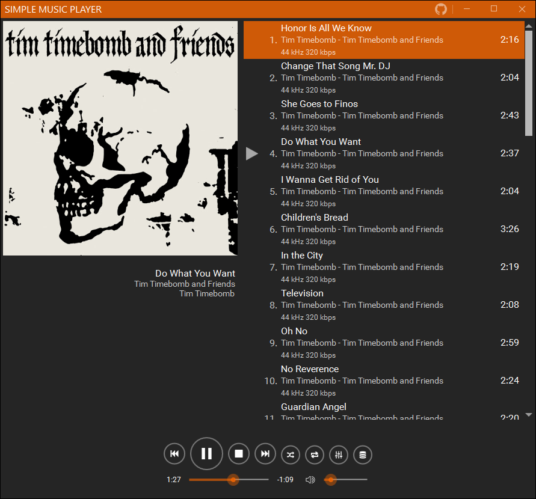  

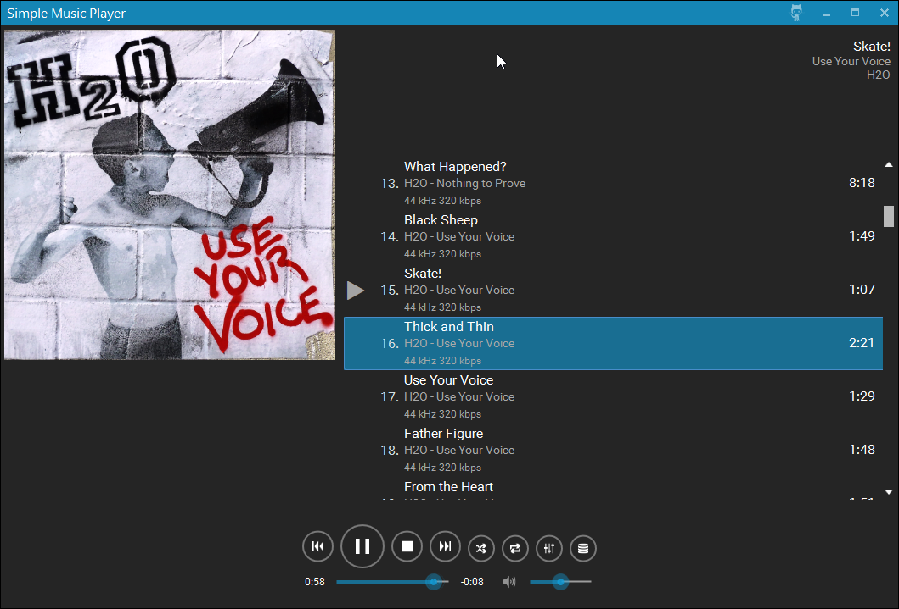  

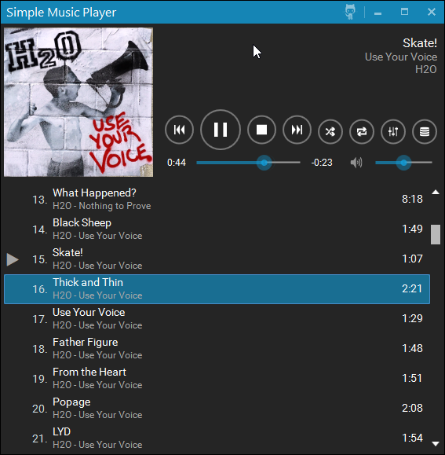  

  

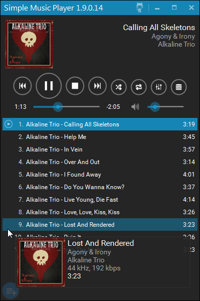  

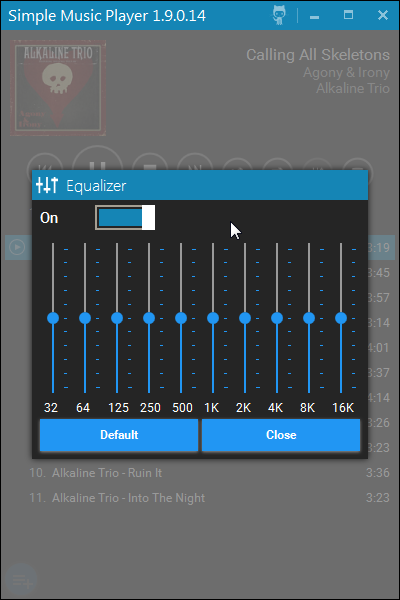  

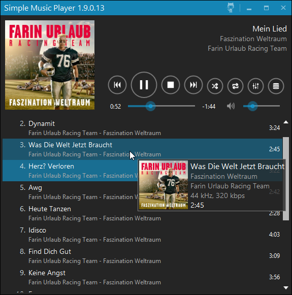  

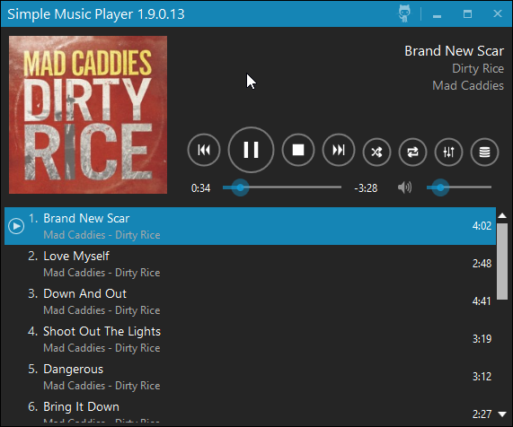  

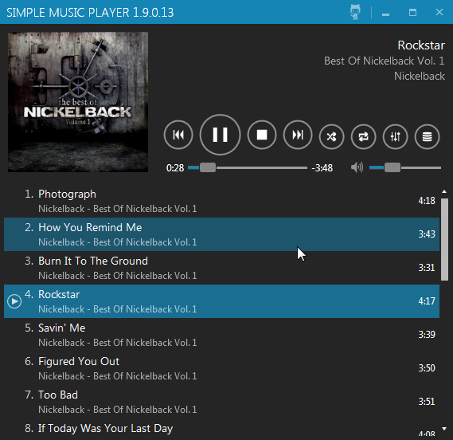  

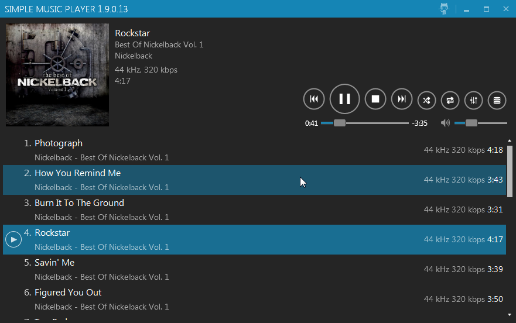  

  

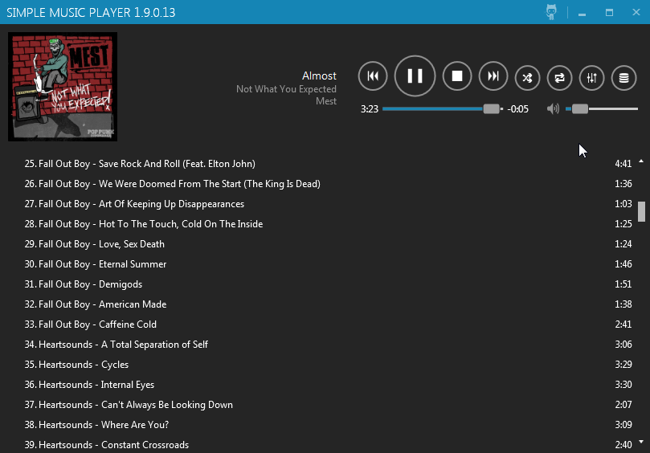  

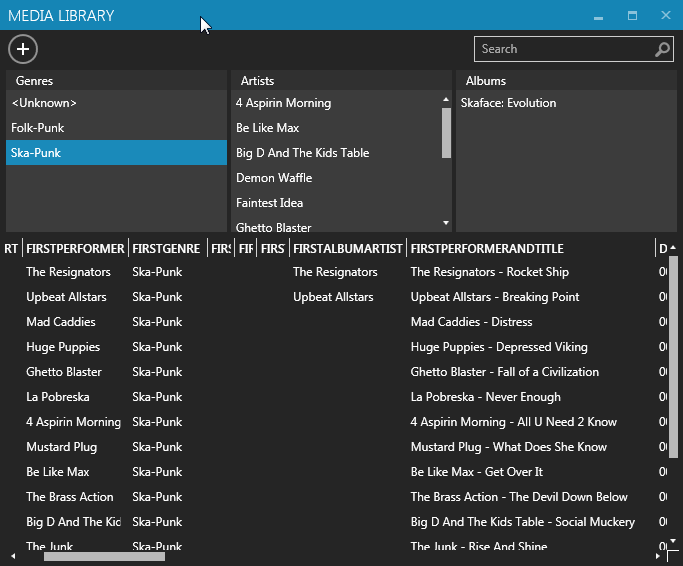  

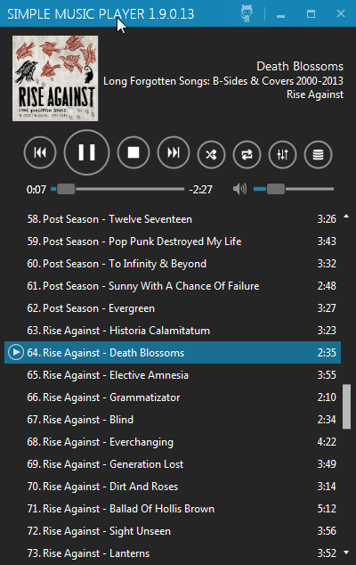  

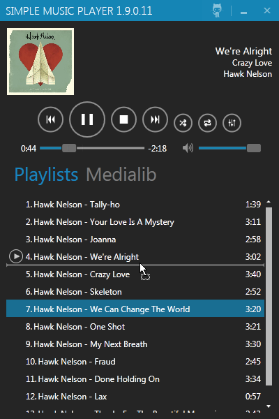  

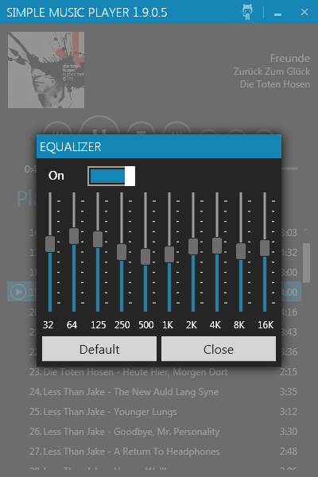  

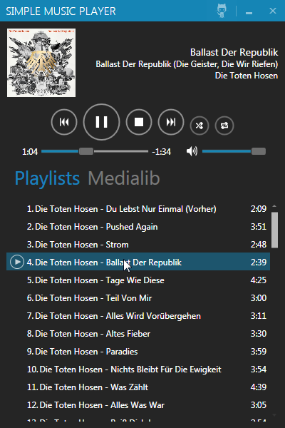  

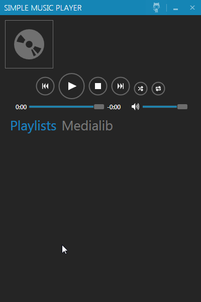  

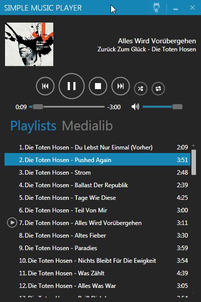  

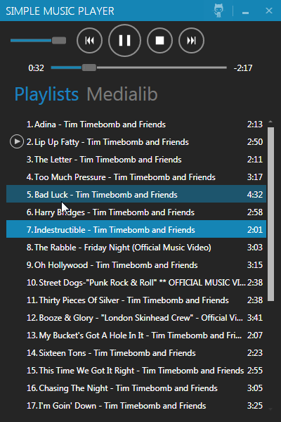  

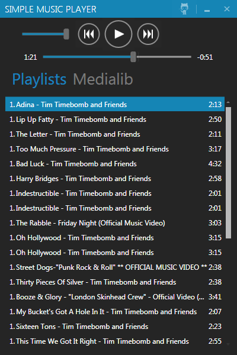  

